# Flow Aplikasi HJAR Flows

Dokumen ini memetakan perilaku aplikasi yang **berjalan saat ini (as-is)** berdasarkan route, navigasi, komponen Livewire, service, model, policy, migration, dan pengujian pada source code. Dokumen ini bukan rancangan ideal; bagian **Titik evaluasi** sengaja mencatat perilaku yang perlu dikonfirmasi atau diperbaiki.

- Tanggal telaah kode: 18 Agustus 2026
- Area: autentikasi, seluruh menu navigasi, aksi akun, penawaran, dokumen penawaran, pekerjaan, laporan, impor, master data, dan audit
- Format diagram: Mermaid flowchart

## 1. Cara membaca dokumen

| Penanda | Arti |
|---|---|
| **Menu permission** | Hak untuk membuka route/menu. |
| **Action permission** | Hak untuk menjalankan aksi tertentu di dalam menu. |
| **As-is** | Perilaku yang benar-benar diterapkan kode saat ini. |
| **Titik evaluasi** | Perilaku yang berpotensi tidak sesuai kebutuhan bisnis, keamanan, atau konsistensi data. |
| `Offer.outcome` | Status komersial penawaran. |
| `WorkOrder.current_status` | Status produksi pekerjaan. |
| `OfferEngagement.workflow_state` | Lifecycle dokumen penawaran; saat ini belum menjadi workflow pengguna yang lengkap. |

## 2. Peta aplikasi tingkat tinggi

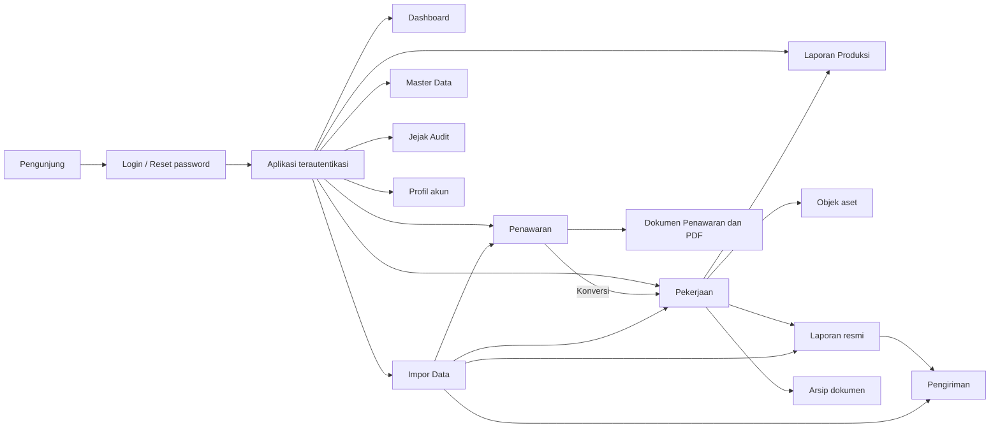

### 2.1 Relasi data utama

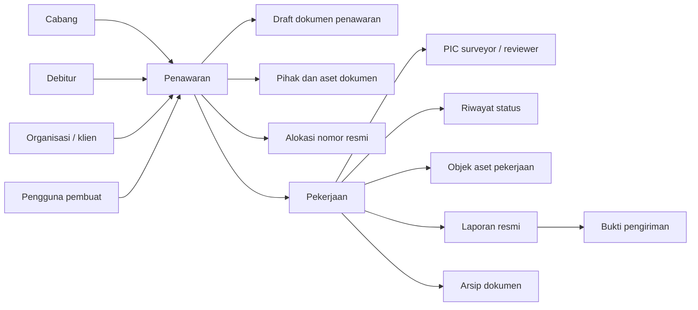

## 3. Hak akses

### 3.1 Matriks role bawaan

Matriks berikut berasal dari `RolePermissionSeeder`. Role tambahan dapat dibuat dari UI, tetapi terdapat batasan yang dicatat pada bagian evaluasi.

| Permission | Sysadmin | Supervisor | Admin | Reviewer | Surveyor |
|---|:---:|:---:|:---:|:---:|:---:|
| Dashboard | Ya | Ya | Ya | Ya | Ya |
| Penawaran | Ya | Ya | Ya | - | - |
| Pekerjaan | Ya | Ya | Ya | Ya | Ya |
| Laporan produksi | Ya | Ya | - | - | - |
| Impor data | Ya | - | - | - | - |
| Jejak audit | Ya | - | - | - | - |
| Master pengguna | Ya | - | - | - | - |
| Master data | Ya | Ya | - | - | - |
| Kelola pengguna dan role | Ya | - | - | - | - |
| Atur PIC | Ya | Ya | - | - | - |
| Ubah status pekerjaan | Ya | Ya | Ya | Ya | - |
| Ubah SLA | Ya | Ya | - | - | - |
| Kelola aset pekerjaan | Ya | Ya | Ya | - | - |
| Aksi survey selesai | Ya | Ya | - | - | Ya |
| Kelola laporan/review/pengiriman/arsip | Ya | Ya | - | Ya | - |
| Lihat dokumen penawaran | Ya | Ya | Ya | - | - |
| Kelola draft dokumen penawaran | Ya | Ya | Ya | - | - |
| Generate PDF draft | Ya | Ya | Ya | - | - |
| Generate PDF siap cetak | Ya | Ya | - | - | - |
| Penawaran lintas cabang | Ya | - | - | - | - |

### 3.2 Flow pemeriksaan akses

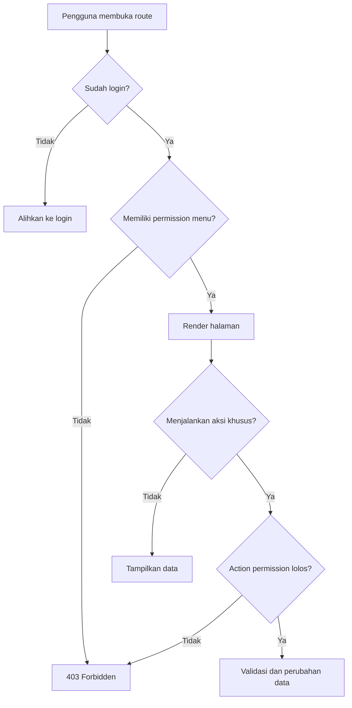

Catatan: scope cabang diterapkan secara eksplisit pada Penawaran dan Dokumen Penawaran, tetapi belum diterapkan konsisten pada Dashboard, Pekerjaan, dan Laporan Produksi.

## 4. Autentikasi dan sesi

### 4.1 Login

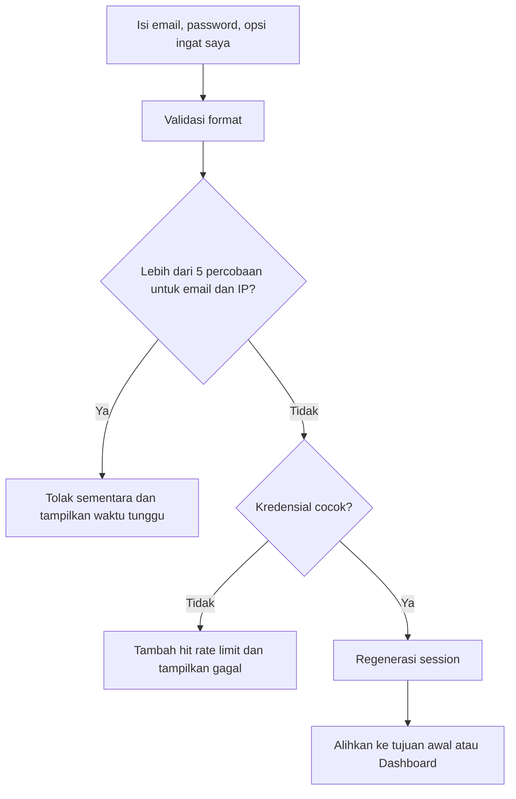

Perilaku saat ini:

- Login memeriksa email dan password.
- Akun dengan `active = false` masih dapat lolos login karena flag aktif tidak ikut diperiksa.
- Dashboard memakai middleware `verified`, tetapi model `User` tidak mengimplementasikan `MustVerifyEmail`, sehingga verifikasi email tidak efektif sebagai gerbang Dashboard.
- Menu lain hanya memakai middleware `auth` dan permission masing-masing.

### 4.2 Pembuatan akun internal

Route publik `/register` tidak tersedia. Akun hanya dibuat melalui menu **Pengguna** oleh pengguna yang memiliki permission `users.manage`.

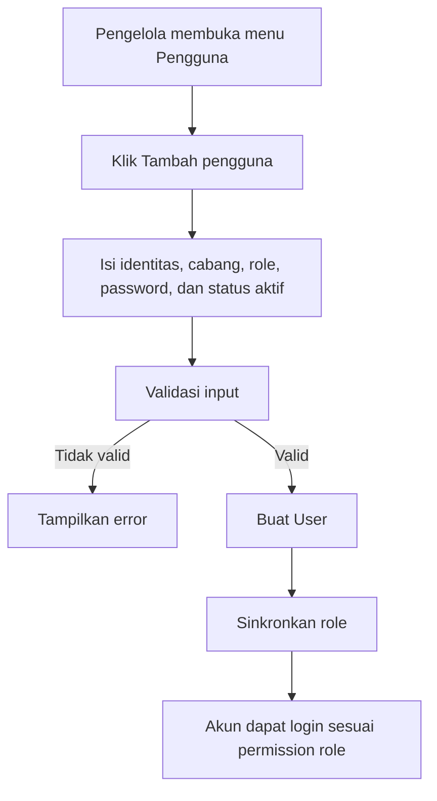

### 4.3 Lupa dan reset password

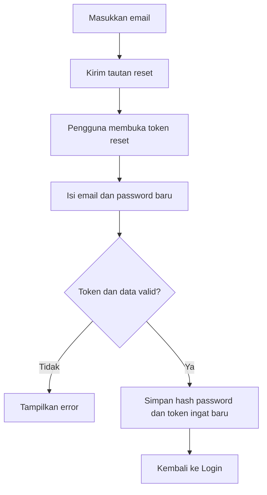

### 4.4 Logout dan tema

- Logout menghapus sesi lalu mengarahkan pengguna ke halaman awal.
- Tema `system`, `light`, atau `dark` disimpan di `localStorage`; tidak mengubah data server.

## 5. Menu Dashboard

- Route: `/dashboard`
- Permission: `menu.dashboard`
- Aksi: filter cabang, membuka daftar pekerjaan terlambat, membuka detail pekerjaan.

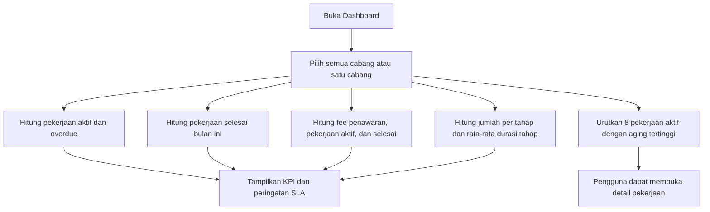

Perhitungan utama:

- Aktif: status selain `SELESAI` dan `BATAL`.
- Overdue: memiliki SLA, tanggal SLA sebelum hari ini, dan belum `SELESAI/BATAL`.
- Aging: selisih hari dari riwayat status terbaru; jika belum ada, dari `created_at` pekerjaan.
- Durasi tahap: selisih waktu antar-riwayat status yang sudah berpindah; aging tahap aktif tidak masuk rata-rata.
- Nilai penawaran aktif: outcome `DRAFT` dan `DIKIRIM`.
- Nilai terealisasi: fee offer milik pekerjaan berstatus `SELESAI`.

Titik evaluasi khusus Dashboard:

- Semua role yang punya Dashboard dapat memilih dan melihat seluruh cabang.
- Rumus kepatuhan SLA adalah `(semua pekerjaan - overdue aktif) / semua pekerjaan`. Pekerjaan yang sudah selesai terlambat tidak lagi dianggap overdue, sehingga label “pekerjaan selesai tepat waktu” tidak sepenuhnya sesuai dengan rumus.

## 6. Menu Penawaran

- Route daftar: `/offers`
- Route tambah: `/offers/create`
- Permission menu: `menu.offers`
- Scope: cabang pengguna; sysadmin atau pemilik `offers.cross-branch` dapat mengakses seluruh cabang.

### 6.1 Status komersial penawaran

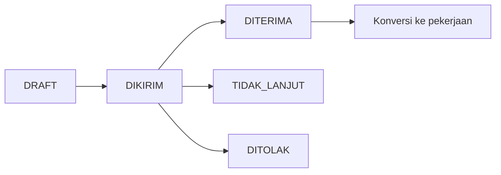

Diagram di atas menggambarkan urutan bisnis yang lazim, tetapi **kode saat ini tidak menegakkan urutan tersebut**. Form tambah/edit dapat memilih salah satu outcome secara langsung dan dapat berpindah maju atau mundur.

### 6.2 Daftar penawaran

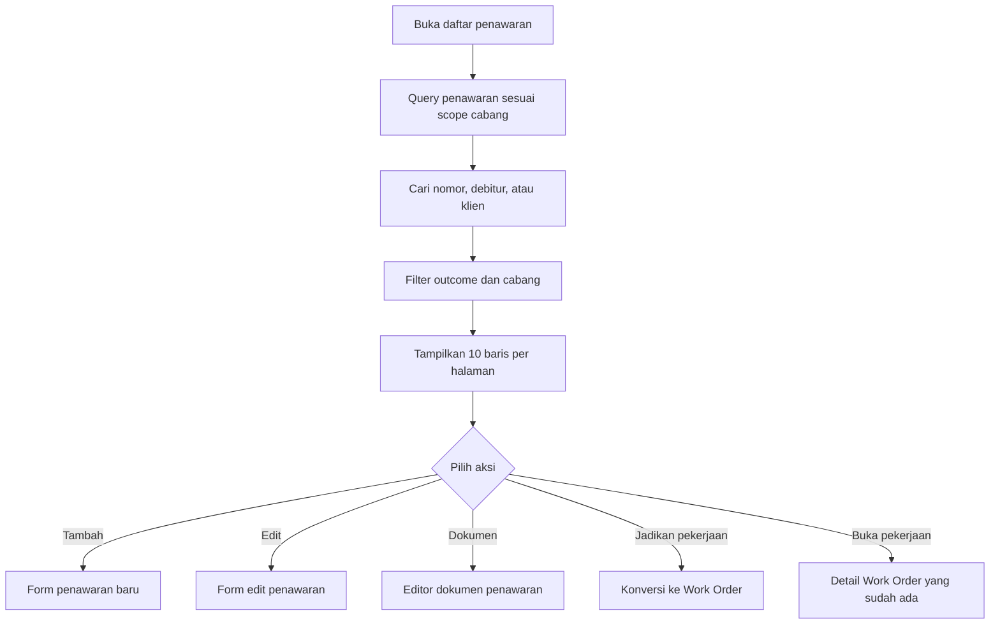

Aturan tombol konversi di UI:

- Jika outcome `DITERIMA` dan pekerjaan sudah ada: tampil “Buka pekerjaan”.
- Jika outcome bukan `TIDAK_LANJUT` dan bukan `DITOLAK`, serta kondisi sebelumnya tidak terpenuhi: tampil “Jadikan pekerjaan”.
- Tombol edit tetap tersedia pada semua outcome dan walaupun sudah memiliki pekerjaan.

### 6.3 Membuat penawaran

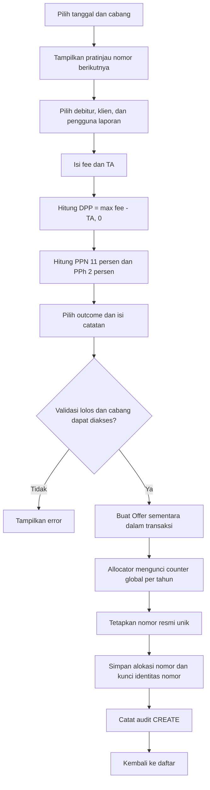

Nomor resmi memakai pola:

`{urutan}/S.Kontrak/KJPP-HJA'R/{kode-angka-cabang}/{bulan-romawi}/{tahun}`

Karakteristik nomor:

- Urutan bersifat global per tahun, bukan per cabang.
- Preview dapat berbeda dari nomor akhir jika ada penyimpanan paralel.
- Alokasi final dilakukan dalam transaksi dan memakai row lock.
- Cabang wajib mempunyai `number_code`.
- Setelah dialokasikan, nomor urut, tanggal penawaran, dan cabang menjadi identitas terkunci.

### 6.4 Mengedit penawaran

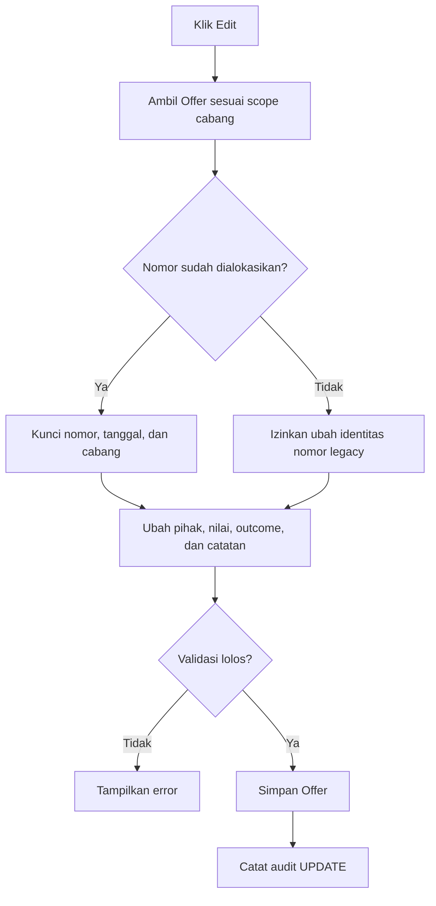

Perubahan outcome tidak memvalidasi keberadaan pekerjaan. Karena itu, penawaran yang sudah dikonversi masih dapat diubah menjadi `DITOLAK` atau `TIDAK_LANJUT` sementara Work Order tetap ada.

### 6.5 Konversi penawaran menjadi pekerjaan

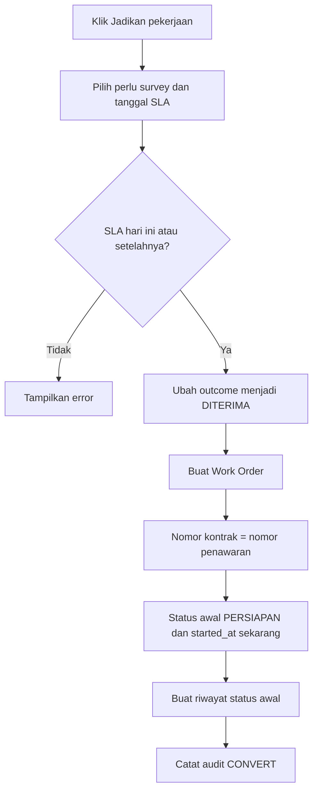

Konversi saat ini tidak dibungkus satu transaksi database. Bila salah satu langkah setelah update outcome gagal, data dapat tertinggal dalam kondisi parsial.

## 7. Submenu Dokumen Penawaran

- Route: `/offers/{offer}/document`
- Policy selalu menggabungkan action permission dan scope cabang.
- Aksi utama: simpan draft, preflight draft, pratinjau PDF, unduh draft, preflight siap cetak, unduh siap cetak.

### 7.1 Permission dokumen

| Aksi | Permission |
|---|---|
| Buka editor | `offers.documents.view` |
| Ubah dan simpan draft | `offers.documents.manage` |
| Preflight/preview/download draft | `offers.documents.generate-draft` |
| Preflight dan download siap cetak | `offers.documents.generate-print-ready` |
| Bypass scope cabang | `offers.cross-branch` |

### 7.2 Isi editor dokumen

1. Master resmi: template, profil penerbit, penandatangan yang approved dan berlaku pada tanggal penawaran.
2. Penerima dan referensi: kota terbit, penerima, organisasi, alamat, perihal, tipe/nomor/tanggal referensi.
3. Lingkup dan keluaran: kepemilikan, mata uang, tujuan, dasar/tanggal nilai, investigasi, format/bahasa/jumlah laporan, durasi.
4. Pihak dan objek: banyak pihak, satu pihak utama, aset per pihak, serta dokumen kepemilikan utama.
5. Biaya dan pajak: item fee, quantity, nilai unit, mode pajak, tarif, biaya transportasi/akomodasi, termin.
6. Persyaratan: daftar permintaan data dan gaya penekanan.
7. Catatan: asumsi khusus dicetak; catatan internal tidak dicetak.

### 7.3 Flow penyimpanan draft

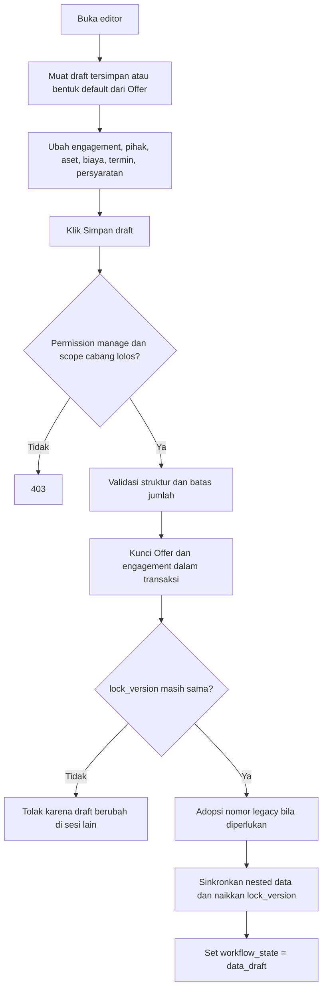

Batas utama: 100 pihak, 10 aset per pihak, 10 dokumen per aset, 500 item fee, 20 termin, dan 100 persyaratan.

### 7.4 Flow PDF draft dan siap cetak

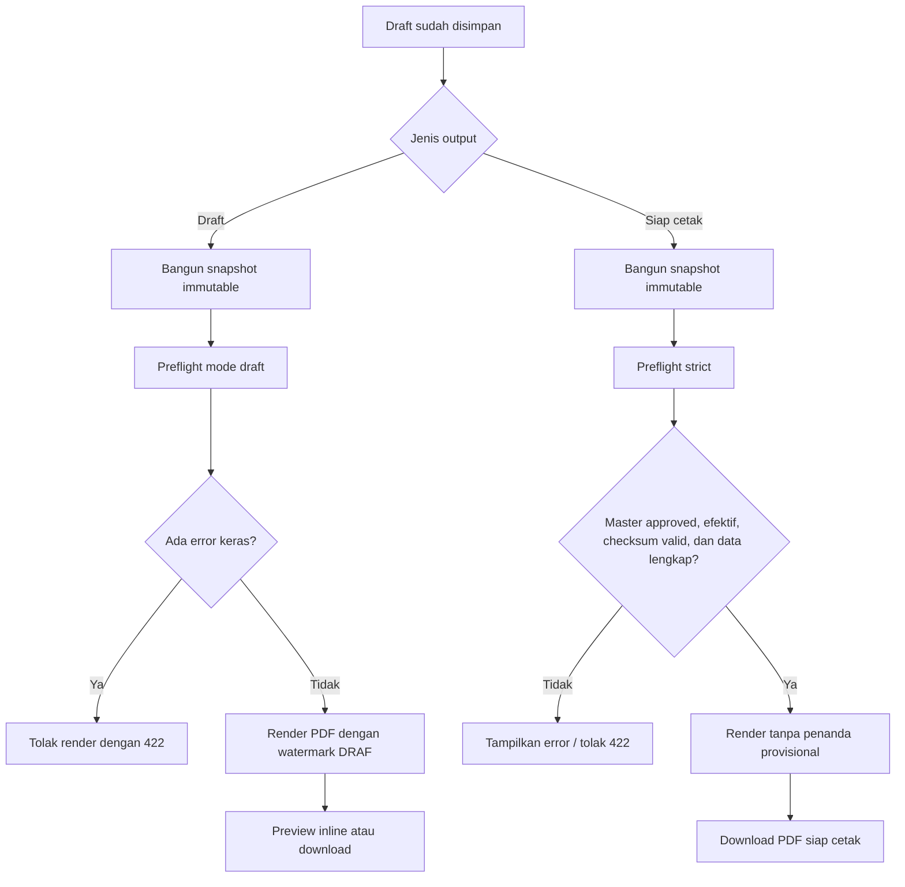

Ketentuan output saat ini:

- PDF dibuat on-demand dan tidak disimpan sebagai artifact aplikasi.
- Preview/download dibatasi `10` request per menit per endpoint.
- Nama file draft maupun siap cetak: `Penawaran-{nomor-penawaran-lengkap-yang-diamankan}.pdf`.
- Preview draft, download draft, dan print-ready dicatat di audit log.
- Preflight dan render membaca draft yang sudah tersimpan di database; perubahan form yang belum disimpan tidak ikut diperiksa.
- Lifecycle `ready_for_review`, `in_review`, `approved`, `finalized`, `sent`, dan `void` sudah tersedia sebagai enum/tabel domain, tetapi belum mempunyai aksi pengguna. Setiap save draft mengembalikan lifecycle ke `data_draft`.
- Tidak ada menu untuk membuat atau menyetujui master template, profil penerbit, dan penandatangan; editor hanya memilih data master yang sudah approved di database.

## 8. Menu Pekerjaan

- Route daftar: `/work-orders`
- Route detail: `/work-orders/{id}`
- Permission menu: `menu.work-orders`
- Saat ini daftar dan detail tidak dibatasi cabang pengguna.

### 8.1 Daftar pekerjaan

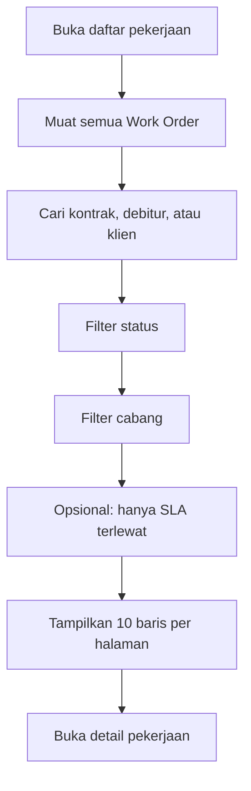

### 8.2 Lifecycle pekerjaan

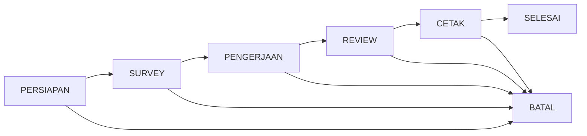

Diagram tersebut adalah alur operasional yang ditampilkan. Namun selama status saat ini bukan `BATAL`, action `change-status` menerima **semua status tujuan**, termasuk lompat tahap, mundur, memilih status yang sama, `SELESAI` tanpa laporan, atau kembali dari `SELESAI`.

Saat masuk `SELESAI`, `completed_at` diisi jika masih kosong. Jika status kemudian dimundurkan, `completed_at` tidak dikosongkan.

### 8.3 Detail dan aksi status

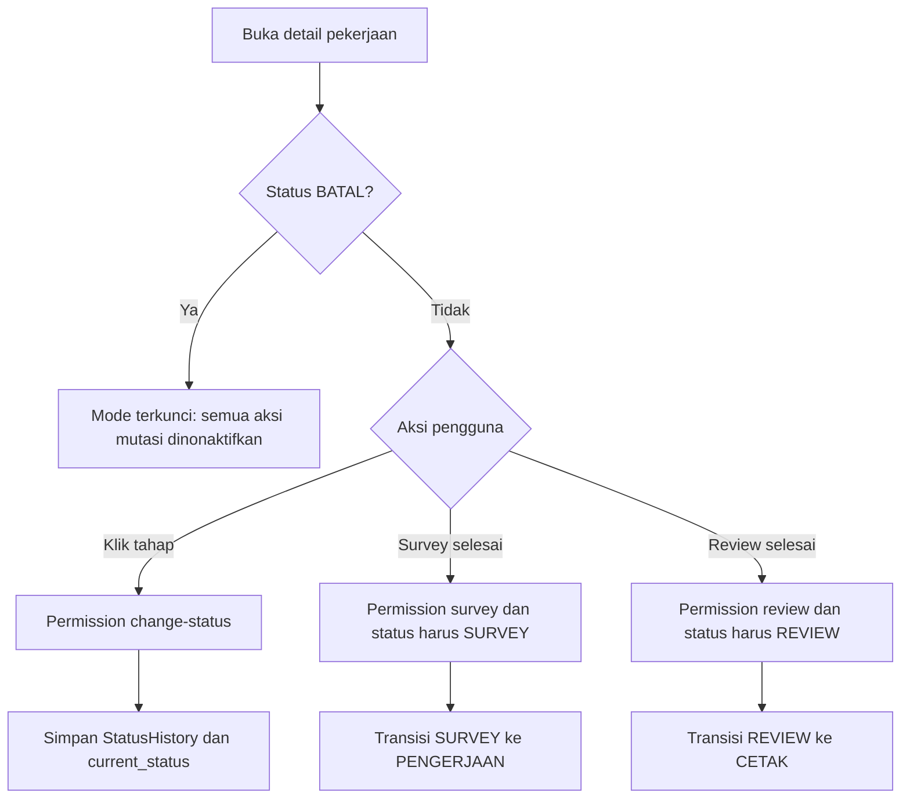

Setiap perubahan status melalui halaman detail membuat `StatusHistory`. Perubahan status pekerjaan belum dicatat ke `ActivityLog` umum.

### 8.4 Atur SLA dan survey

Permission: `work-orders.edit-sla`.

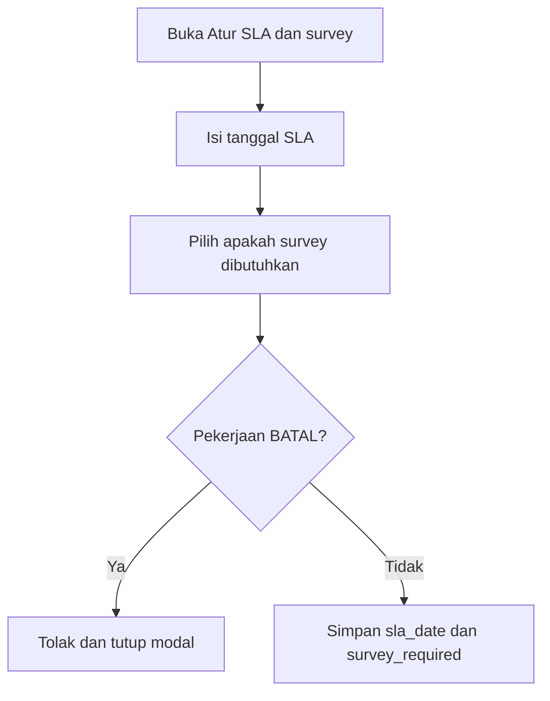

Tanggal SLA hanya divalidasi sebagai tanggal; boleh berada di masa lalu.

### 8.5 Atur PIC

Permission: `work-orders.assign-pic`.

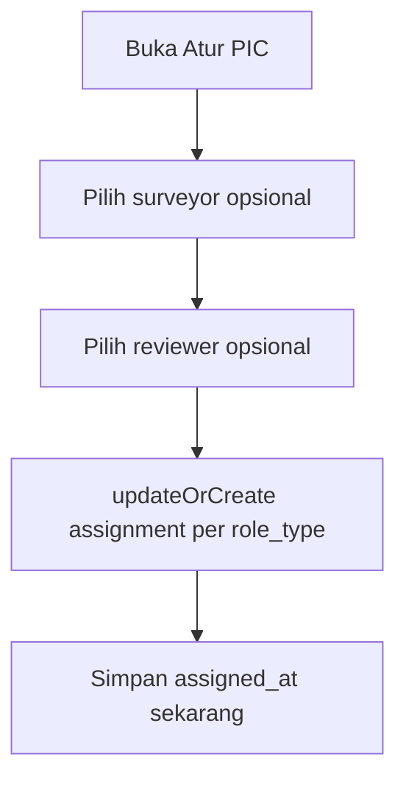

Kandidat saat ini:

- Surveyor: pengguna aktif dengan kolom role `surveyor`, `admin`, atau `sysadmin`.
- Reviewer: pengguna aktif dengan kolom role `reviewer`, `admin`, atau `sysadmin`.
- Tidak difilter berdasarkan cabang.
- Assignment lama tidak otomatis dipilih saat modal dibuka.
- Tidak ada aksi mengosongkan/unassign PIC; pilihan kosong hanya berarti tidak mengubah assignment tersebut.

### 8.6 Tab Informasi Utama

Tab ini hanya baca dan menampilkan:

- nomor/tanggal kontrak, debitur, klien, pengguna laporan, dan flag survey;
- fee, DPP, PPN, dan PPh dari Offer;
- riwayat status beserta pengguna, catatan, dan waktu;
- SLA, overdue, aging status, surveyor, dan reviewer.

### 8.7 Tab Objek Aset

Permission mutasi: `work-orders.manage-assets`.

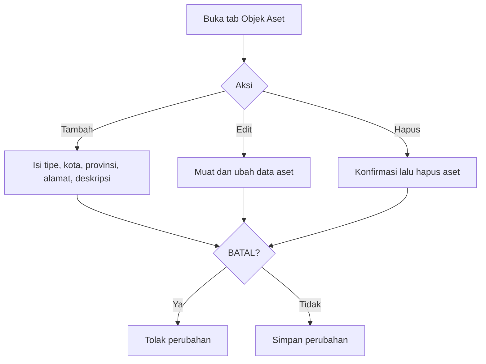

Jenis yang tersedia di UI: tanah dan bangunan, tanah kosong, mesin/peralatan, kendaraan, inventaris, dan lainnya.

### 8.8 Tab Laporan Resmi dan Pengiriman

Permission mutasi: `work-orders.review`.

```mermaid
flowchart TD
    A["Buka tab Laporan Resmi"] --> B{"Aksi laporan"}
    B -->|"Tambah"| C["Nomor laporan dipaksa sama dengan nomor kontrak"]
    B -->|"Edit"| D["Ubah tanggal, tujuan, nilai, tanggal cetak, aset terkait"]
    B -->|"Hapus"| E["Hapus laporan dan data turunannya sesuai FK"]
    C --> F{"Nomor laporan sudah ada?"}
    F -->|"Ya"| G["Tolak duplikat; arahkan edit laporan lama"]
    F -->|"Tidak"| H["Simpan laporan"]
    D --> H
    H --> I["Pilih aksi Pengiriman"]
    I --> J["Isi tanggal kirim, kurir, resi, tanggal diterima, penerima, catatan"]
    J --> K["updateOrCreate satu Delivery per laporan"]
```

Catatan:

- UI efektif membatasi satu laporan per pekerjaan karena nomor laporan selalu sama dengan nomor kontrak dan kolom `report_no` unik global.
- Penyimpanan laporan belum mengubah status pekerjaan, `final_at`, atau memastikan status berada di REVIEW/CETAK.
- Data pengiriman belum otomatis mengubah status pekerjaan menjadi `SELESAI`.

### 8.9 Tab Arsip Dokumen

Permission mutasi: `work-orders.review`.

```mermaid
flowchart TD
    A["Buka tab Arsip Dokumen"] --> B{"Aksi"}
    B -->|"Unggah"| C["Isi judul, tipe, dan file maksimal 10 MB"]
    C --> D["Simpan file ke disk public"]
    D --> E["Buat record Document"]
    B -->|"Buka"| F["Buka URL storage file"]
    B -->|"Hapus"| G["Hapus file jika ada lalu hapus record"]
```

Tipe arsip UI: penawaran/kontrak, data survey, draft laporan, scan laporan final, PDF historis, dan lainnya.

### 8.10 Lock pekerjaan BATAL

Jika status sudah `BATAL`, halaman detail:

- menonaktifkan perubahan status, SLA, survey flag, PIC, aset, laporan, pengiriman, dan arsip;
- memeriksa ulang status di server sebelum setiap mutasi;
- menutup semua modal dan menampilkan pesan bila request lama mencoba mengubah data.

Lock ini diterapkan pada komponen `WorkOrders.Show`, belum berupa aturan model/database global. Service impor atau kode lain masih dapat memperbarui Work Order berstatus `BATAL` secara langsung.

## 9. Menu Laporan Produksi

- Route: `/reports/production`
- Permission: `menu.reports`
- Role bawaan: sysadmin dan supervisor.

```mermaid
flowchart TD
    A["Buka Laporan Produksi"] --> B["Filter cabang"]
    B --> C["Tampilkan tren fee pekerjaan selesai"]
    C --> D["Pilih tren bulanan atau tahunan"]
    B --> E["Hitung funnel outcome dan conversion rate"]
    B --> F["Filter tabel: status dan rentang created_at pekerjaan"]
    F --> G["Tampilkan pekerjaan 15 baris per halaman"]
    G --> H["Ekspor Excel dengan filter cabang, tanggal, dan status"]
```

Isi ekspor Excel:

- identitas kontrak, cabang, debitur, klien, pengguna laporan;
- fee, TA, DPP, PPN, PPh;
- survey, SLA, status, PIC, aging, overdue;
- laporan resmi dan pengiriman.

Perilaku filter:

- Cabang memengaruhi tabel, tren pendapatan, funnel, dan ekspor.
- Status serta tanggal hanya memengaruhi tabel dan ekspor, bukan tren/funnel.
- Tanggal menggunakan `WorkOrder.created_at`, bukan tanggal kontrak atau selesai.
- Satu Work Order dapat menghasilkan beberapa baris Excel bila mempunyai beberapa Report.
- Ekspor belum dicatat sebagai action `EXPORT` pada audit log.
- Tidak ada scope cabang berdasarkan akun; pemilik menu dapat memilih seluruh cabang.

## 10. Menu Impor Data

- Route: `/imports`
- Permission: `menu.imports`
- Role bawaan: sysadmin.

### 10.1 Flow impor

```mermaid
flowchart TD
    A["Unduh template CSV opsional"] --> B["Pilih cabang fallback"]
    B --> C["Unggah CSV/TXT maksimal 10 MB"]
    C --> D["Parse baris dan simpan ImportStaging dengan batch UUID"]
    D --> E["Tinjau preview staging"]
    E --> F{"Aksi"}
    F -->|"Bersihkan"| G["Hapus seluruh staging batch"]
    F -->|"Proses"| H["Proses setiap baris yang belum processed"]
    H --> I["firstOrCreate cabang, debitur, dan organisasi"]
    I --> J["updateOrCreate Offer berdasarkan offer_no"]
    J --> K["updateOrCreate Work Order berdasarkan offer_id"]
    K --> L["Buat StatusHistory"]
    L --> M{"Ada nomor laporan?"}
    M -->|"Ya"| N["updateOrCreate Report"]
    N --> O{"Ada kurir atau resi?"}
    O -->|"Ya"| P["updateOrCreate Delivery"]
    O -->|"Tidak"| Q["Lewati Delivery"]
    M -->|"Tidak"| R["Lewati Report"]
    P --> S["Tandai baris processed"]
    Q --> S
    R --> S
    H -->|"Exception per baris"| T["Simpan error_message dan lanjut baris berikutnya"]
```

Normalisasi impor saat ini:

- Baris kosong atau tanpa nomor penawaran dilewati.
- Kode cabang kosong memakai cabang fallback.
- Tanggal invalid menjadi `null` tanpa error staging.
- Status di luar daftar valid otomatis menjadi `SELESAI`.
- Offer hasil impor selalu outcome `DITERIMA`.
- SLA default adalah tanggal kontrak + 14 hari.
- Cabang yang belum ada dibuat tanpa `number_code`.
- Proses bersifat upsert dan dapat menimpa Offer/Work Order/Report yang memiliki kunci sama.
- Pemrosesan tidak menggunakan satu transaksi per baris; kegagalan di tengah baris dapat meninggalkan sebagian record yang sudah dibuat.
- Batch staging tidak menyimpan pemilik pengguna dan `currentBatchId` bukan locked property.

## 11. Menu Cabang

- Route: `/master/branches`
- Permission route dan seluruh aksi: `menu.master-data`.

```mermaid
flowchart TD
    A["Buka Master Cabang"] --> B["Cari kode atau nama"]
    B --> C{"Aksi"}
    C -->|"Tambah"| D["Isi kode, kode angka, nama, aktif"]
    C -->|"Edit"| E["Ubah data cabang"]
    C -->|"Aktif/nonaktif"| F["Toggle flag active"]
    D --> G["Validasi code dan number_code unik"]
    E --> G
    G --> H["Simpan"]
```

Tidak ada aksi hapus cabang. Cabang nonaktif tidak muncul dalam pilihan operasional baru, tetapi data historis tetap tersimpan.

## 12. Menu Pengguna

- Route: `/master/users`
- Permission membuka menu: `menu.master-users`.
- Permission tambah/edit/aktif-nonaktif: `users.manage`.

```mermaid
flowchart TD
    A["Buka daftar pengguna"] --> B["Cari nama/email dan filter role/cabang"]
    B --> C{"Aksi"}
    C -->|"Tambah"| D["Isi identitas, cabang, role, password, aktif"]
    C -->|"Edit"| E["Ubah data; password opsional"]
    C -->|"Aktif/nonaktif"| F["Toggle active"]
    D --> G["Simpan User dan sync Spatie Role"]
    E --> G
```

Role yang dapat dipilih dari form dibatasi pada `sysadmin`, `supervisor`, `admin`, `reviewer`, dan `surveyor`.

## 13. Menu Peran dan Hak Akses

- Route: `/master/roles-permissions`
- Permission route dan aksi: `users.manage`.

```mermaid
flowchart TD
    A["Buka Peran dan Hak Akses"] --> B["Pilih role"]
    B --> C{"Role terlindungi?"}
    C -->|"Sysadmin atau role akun sendiri"| D["Checkbox dan simpan dinonaktifkan"]
    C -->|"Tidak"| E["Pilih permission menu dan aksi"]
    E --> F["Simpan dengan syncPermissions"]
    F --> G["Bersihkan permission cache"]
    A --> H["Tambah role baru"]
    H --> I["Normalisasi huruf kecil dan spasi menjadi underscore"]
    I --> J["Buat role tanpa permission"]
```

Role baru dapat dibuat, tetapi tidak dapat dipilih pada form Pengguna karena validasi form Pengguna hanya menerima lima role bawaan.

## 14. Menu Klien / Organisasi

- Route: `/master/organizations`
- Permission route dan seluruh aksi: `menu.master-data`.

```mermaid
flowchart TD
    A["Buka Master Klien"] --> B["Cari nama/NPWP dan filter tipe"]
    B --> C{"Aksi"}
    C -->|"Tambah"| D["Isi nama, tipe, alamat, NPWP, telepon"]
    C -->|"Edit"| E["Ubah data organisasi"]
    C -->|"Hapus"| F["Konfirmasi lalu delete"]
    D --> G["Validasi dan simpan"]
    E --> G
```

Tipe organisasi: pemberi tugas, pengguna laporan, klien, dan lainnya. Delete tidak melakukan pemeriksaan dependency atau penanganan error khusus sebelum menghapus.

## 15. Menu Debitur

- Route: `/master/debtors`
- Permission route dan seluruh aksi: `menu.master-data`.

```mermaid
flowchart TD
    A["Buka Master Debitur"] --> B["Cari nama atau identifier"]
    B --> C{"Aksi"}
    C -->|"Tambah"| D["Isi nama, identifier, alamat"]
    C -->|"Edit"| E["Ubah data debitur"]
    C -->|"Hapus"| F["Konfirmasi lalu delete"]
    D --> G["Validasi dan simpan"]
    E --> G
```

Delete tidak melakukan pemeriksaan dependency atau penanganan error khusus sebelum menghapus.

## 16. Menu Jejak Audit

- Route: `/audit-logs`
- Permission: `menu.audit-logs`
- Role bawaan: sysadmin.

```mermaid
flowchart TD
    A["Buka Jejak Audit"] --> B["Filter deskripsi/IP, pengguna aktif, dan action"]
    B --> C["Tampilkan log terbaru 20 baris per halaman"]
    A --> D["Klik Buat cadangan"]
    D --> E["Jalankan command db:backup-sqlite"]
    E --> F{"File database.sqlite ada dan dapat disalin?"}
    F -->|"Ya"| G["Salin ke storage/app/backups"]
    G --> H["Catat BACKUP ke ActivityLog"]
    F -->|"Tidak"| I["Command gagal"]
```

### 16.1 Cakupan audit aktual

| Area | Action yang tercatat saat ini |
|---|---|
| Penawaran | `CREATE`, `UPDATE`, `CONVERT` |
| PDF penawaran | `PREVIEW_DRAFT`, `DOWNLOAD_DRAFT`, `GENERATE_PRINT_READY` |
| Approval master dokumen melalui service | Action approval dari service |
| Backup SQLite | `BACKUP` bila copy berhasil |
| Pekerjaan/status/SLA/PIC/aset/laporan/pengiriman/arsip | Belum dicatat ke ActivityLog |
| Master cabang/pengguna/role/klien/debitur | Belum dicatat |
| Impor data | Belum dicatat |
| Ekspor laporan | Belum dicatat sebagai `EXPORT` |

Komponen Jejak Audit selalu menampilkan pesan sukses setelah memanggil command backup dan tidak memeriksa exit code command. Jika command gagal, pesan UI tetap menyatakan backup berhasil.

Filter action pada UI hanya menyediakan `CREATE`, `UPDATE`, `DELETE`, `OVERRIDE`, `CONVERT`, `BACKUP`, dan `EXPORT`. Action PDF tetap tampil di daftar, tetapi tidak dapat dipilih langsung dari dropdown filter.

## 17. Menu Profil Akun

- Route: `/profile`
- Akses: pengguna yang sudah login.

```mermaid
flowchart TD
    A["Buka Profil"] --> B{"Aksi"}
    B -->|"Ubah nama/email"| C["Validasi dan simpan profil"]
    C --> D{"Email berubah dan verifikasi digunakan?"}
    D -->|"Ya"| E["Kosongkan email_verified_at dan kirim ulang verifikasi opsional"]
    B -->|"Ubah password"| F["Validasi password saat ini dan konfirmasi password baru"]
    F --> G["Simpan hash password baru"]
    B -->|"Hapus akun"| H["Konfirmasi password"]
    H --> I["Logout lalu delete User"]
```

Penghapusan akun dapat gagal bila akun masih direferensikan data operasional dengan foreign key yang membatasi delete.

## 18. Titik evaluasi prioritas

Bagian ini merangkum perilaku aktual yang paling perlu diputuskan. Urutan menunjukkan prioritas telaah, bukan perubahan yang sudah dilakukan.

### Prioritas tinggi

| ID | Temuan as-is | Risiko atau keputusan yang diperlukan |
|---|---|---|
| E-01 | Dashboard, daftar/detail Pekerjaan, dan Laporan Produksi tidak menerapkan scope cabang akun. | Pengguna cabang dapat melihat data seluruh cabang. Tentukan apakah akses harus per cabang seperti Penawaran. |
| E-02 | Detail pekerjaan mengambil Work Order dan record anak dengan `findOrFail` global tanpa memastikan record milik pekerjaan yang sedang dibuka. | Request Livewire yang dimanipulasi berpotensi mengedit/menghapus aset, laporan, delivery, atau dokumen pekerjaan lain. Perlu policy dan ownership query. |
| E-03 | `change-status` mengizinkan perpindahan dari status mana pun ke status mana pun. | Tahap dapat dilompati/dimundurkan dan `SELESAI` tidak membutuhkan laporan/pengiriman. Tentukan transition matrix dan prerequisite. |
| E-04 | Konversi Offer ke Work Order tidak memakai satu transaksi. | Kegagalan di tengah proses dapat menghasilkan outcome `DITERIMA` tanpa pekerjaan atau pekerjaan tanpa history/audit. |
| E-05 | Registrasi publik sudah ditutup, tetapi pengguna masih dapat menghapus akun sendiri melalui Profil. | Tentukan apakah self-service account deletion sesuai kebijakan akun internal. |
| E-06 | Flag `User.active` tidak diperiksa saat login. | Akun yang dinonaktifkan tetap dapat membuat sesi baru. |
| E-07 | Import melakukan upsert terhadap data produksi tanpa transaksi per baris atau layar resolusi konflik. | Data existing dapat tertimpa dan kegagalan parsial dapat meninggalkan record setengah jadi. |

### Prioritas menengah

| ID | Temuan as-is | Risiko atau keputusan yang diperlukan |
|---|---|---|
| E-08 | Lock `BATAL` hanya ditegakkan di komponen detail pekerjaan. | Jalur service, import, job, atau perubahan model langsung masih dapat mengubah pekerjaan batal. Pertimbangkan domain guard global. |
| E-09 | Offer yang sudah memiliki Work Order masih dapat diedit outcomenya menjadi ditolak/tidak lanjut. | Status komersial dan pekerjaan dapat bertentangan; link pekerjaan juga dapat hilang dari daftar Penawaran. |
| E-10 | Status pekerjaan tidak bergantung pada laporan, tanggal cetak, delivery, atau arsip final. | Data produksi dapat menyatakan selesai tanpa bukti keluaran. Tentukan prerequisite per tahap. |
| E-11 | `completed_at` tidak dikosongkan bila status dimundurkan dari `SELESAI`. | KPI selesai dan data status dapat bertentangan. |
| E-12 | Role disimpan pada dua sumber: kolom `users.role` dan Spatie Role. | Keduanya dapat tidak sinkron; permission memakai Spatie, sementara pilihan PIC/helper memakai string role. |
| E-13 | Role custom dapat dibuat tetapi tidak dapat diberikan melalui form Pengguna. | Fitur “Tambah peran” belum mempunyai flow assignment lengkap. |
| E-14 | Kandidat PIC tidak dibatasi cabang dan supervisor tidak masuk kandidat walau mempunyai permission survey/review. | Penugasan dapat lintas cabang dan tidak konsisten dengan permission. |
| E-15 | Modal PIC tidak memuat assignment aktif dan tidak menyediakan unassign. | Pengguna tidak mendapat state awal yang jelas dan tidak dapat menghapus PIC. |
| E-16 | Audit log hanya mencakup sebagian kecil aksi operasional. | Jejak perubahan status, SLA, PIC, aset, laporan, pengguna, master, impor, dan ekspor tidak tersedia. |
| E-17 | Lifecycle dokumen (`review/approve/finalize/send`) dan version/artifact masih dormant. | PDF siap cetak dapat dibuat tanpa workflow persetujuan pengguna yang lengkap; tentukan apakah preflight saja cukup. |
| E-18 | Tidak ada menu pengelolaan/approval master template, penerbit, dan penandatangan. | Print-ready bergantung pada seed atau proses di luar UI. |

### Prioritas rendah atau klarifikasi produk

| ID | Temuan as-is | Risiko atau keputusan yang diperlukan |
|---|---|---|
| E-19 | Dashboard menyebut kepatuhan SLA sebagai selesai tepat waktu, tetapi rumus memakai semua pekerjaan dikurangi overdue aktif. | Label KPI berpotensi menyesatkan; tetapkan definisi SLA historis. |
| E-20 | Status/tanggal pada Laporan Produksi tidak memengaruhi chart/funnel. | Pengguna dapat mengira semua widget mengikuti seluruh filter. |
| E-21 | Laporan resmi secara UI hanya satu per pekerjaan, sementara relasi/model dan ekspor mendukung banyak laporan. | Putuskan cardinality laporan yang benar. |
| E-22 | Nilai komersial dokumen penawaran disimpan terpisah dari `Offer.fee` yang dipakai dashboard/report produksi. | Nilai PDF dan nilai monitoring dapat berbeda setelah draft dokumen diubah. Tentukan sumber nilai utama. |
| E-23 | Delete organisasi/debitur dan delete akun tidak mempunyai preflight dependency yang ramah pengguna. | Foreign key dapat memunculkan error teknis saat data masih digunakan. |
| E-24 | UI backup selalu menyatakan berhasil tanpa membaca exit code command. | Pesan sukses palsu bila file SQLite tidak ada atau gagal disalin. |
| E-25 | Tanggal invalid pada CSV menjadi kosong dan status invalid menjadi `SELESAI`. | Kesalahan sumber data dapat terlihat sebagai data valid. Sebaiknya staging menampilkan validation error eksplisit. |
| E-26 | Kondisi pencarian pada daftar Pekerjaan dan Master Organisasi memakai rangkaian `where/orWhere` tanpa grouping sebelum filter berikutnya. | Filter status/cabang/tipe dapat tidak diterapkan konsisten pada seluruh hasil pencarian. |
| E-27 | Perubahan status membuat history dan memperbarui Work Order dalam operasi terpisah tanpa transaction. | Kegagalan setelah salah satu write berpotensi membuat history dan status aktif tidak sinkron. |

## 19. Checklist evaluasi bisnis

Gunakan checklist berikut saat menelaah flow:

- [ ] Apakah setiap role hanya boleh melihat data cabangnya?
- [ ] Siapa yang boleh melihat data lintas cabang untuk Dashboard, Pekerjaan, dan Laporan?
- [ ] Apakah urutan status pekerjaan wajib berurutan?
- [ ] Dari tahap mana saja status `BATAL` boleh dipilih?
- [ ] Apakah pekerjaan `BATAL` harus immutable di seluruh layer?
- [ ] Apa prerequisite untuk masuk REVIEW, CETAK, dan SELESAI?
- [ ] Bolehkah status `SELESAI` dimundurkan? Jika boleh, bagaimana `completed_at` diperlakukan?
- [ ] Apakah Offer yang sudah menjadi pekerjaan masih boleh diubah outcome dan nilai dasarnya?
- [ ] Apakah satu pekerjaan boleh mempunyai lebih dari satu laporan resmi?
- [ ] Apakah nilai fee utama berasal dari Offer atau item komersial dokumen?
- [x] Registrasi publik ditutup; akun hanya dibuat melalui menu Pengguna.
- [ ] Apakah akun nonaktif harus langsung ditolak saat login dan sesinya dicabut?
- [ ] Apakah custom role memang diperlukan dan harus dapat di-assign dari menu Pengguna?
- [ ] Apakah PIC wajib satu cabang dengan pekerjaan?
- [ ] Aksi apa saja yang wajib masuk audit trail?
- [ ] Apakah impor boleh menimpa data existing atau harus insert-only/review conflict?
- [ ] Siapa yang membuat dan menyetujui master dokumen resmi?
- [ ] Apakah PDF siap cetak memerlukan approval eksplisit sebelum dapat diunduh?

## 20. Peta source code

| Area | Sumber utama |
|---|---|
| Route dan middleware | `routes/web.php`, `routes/auth.php` |
| Navigasi | `resources/views/components/app-navigation-links.blade.php` |
| Role dan permission | `database/seeders/RolePermissionSeeder.php` |
| Dashboard | `app/Livewire/Dashboard.php` |
| Penawaran | `app/Livewire/Offers/Create.php`, `app/Livewire/Offers/Index.php` |
| Nomor penawaran | `app/Services/Offers/OfferNumberAllocator.php` |
| Dokumen penawaran | `app/Livewire/Offers/DocumentEditor.php`, `app/Policies/OfferPolicy.php` |
| PDF penawaran | `app/Http/Controllers/OfferDocumentController.php`, `app/Services/Offers/OfferDocumentRenderer.php` |
| Pekerjaan | `app/Livewire/WorkOrders/Index.php`, `app/Livewire/WorkOrders/Show.php` |
| Laporan produksi | `app/Livewire/Reports/ProductionReport.php`, `app/Services/ProductionExportService.php` |
| Impor | `app/Livewire/Imports/DataImport.php`, `app/Services/ProductionImportService.php` |
| Master data | `app/Livewire/Master/*` |
| Audit dan backup | `app/Livewire/Audit/ActivityLogIndex.php`, `app/Console/Commands/BackupDatabaseCommand.php` |
| Profil | `resources/views/livewire/profile/*` |
